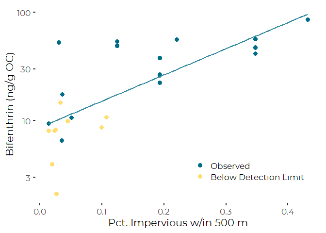

Load Pesticides Data And Report out Summary Bifenthrin Data
================
Curtis C. Bohlen, Casco Bay Estuary Partnership

  - [Introduction](#introduction)
  - [Load Libraries](#load-libraries)
  - [Load Data](#load-data)
      - [Folder References](#folder-references)
      - [Load IC Data](#load-ic-data)
      - [Load Pyrethroid Concentration
        Data](#load-pyrethroid-concentration-data)
  - [Import IC metrics into
    conc\_data](#import-ic-metrics-into-conc_data)
  - [Principal Graphic](#principal-graphic)
      - [Related Linear Models](#related-linear-models)
  - [Alternate Graphic](#alternate-graphic)


# Introduction

In 2014 and 2015, the Maine Board of Pesticides Control collected
sediment samples from the Coast of Maine and Casco Bay, and analyzed
them for presence of selected pesticides, especially certain pyrethroid
pesticides.

The only pyrethroid that was observed consistently was bifenthrin,
probably because bifenthrin could be detected in sediment samples at
substantially lower concentrations than the other pyrethroid pesticides
on the testing panel.

We focus our analysis on bifenthrin. Our principal goal is to produce a
MAP of average bifenthrin concentrations and a FIGURE showing the
relationship between bifenthrin concentration and extent of nearby
impervious surfaces (as a rough measure of urbanization).

# Load Libraries

``` r
library(tidyverse)
```

    ## -- Attaching packages --------------------------------------- tidyverse 1.3.0 --

    ## v ggplot2 3.3.2     v purrr   0.3.4
    ## v tibble  3.0.3     v dplyr   1.0.0
    ## v tidyr   1.1.0     v stringr 1.4.0
    ## v readr   1.3.1     v forcats 0.5.0

    ## -- Conflicts ------------------------------------------ tidyverse_conflicts() --
    ## x dplyr::filter() masks stats::filter()
    ## x dplyr::lag()    masks stats::lag()

``` r
library(CBEPgraphics)
load_cbep_fonts()

library(LCensMeans)
```

# Load Data

## Folder References

``` r
sibfldnm <- 'Derived_Data'
parent   <- dirname(getwd())
sibling  <- file.path(parent,sibfldnm)

conc_fn <- 'BPC_2014_2015_Sediment_Data.txt'
geogr_fn <- 'imperviousness.txt'
```

## Load IC Data

``` r
ic_data <- read.delim(file.path(sibling, geogr_fn), sep = ',') %>%
  select(-OBJECTID, -Latitude, -Longitude) %>%
  rename(yr = 'Year_') %>%
  mutate(pctI500 = imperv500 / (pi*500^2),
         pctI1000 = imperv1000 / (pi*1000^2),
         pctI2000 = imperv2000 / (pi*2000^2)) %>%
  filter(Location != 8)       # Remove Bothbay Location
```

## Load Pyrethroid Concentration Data

``` r
conc_data <- read.delim(file.path(sibling, conc_fn), skip = 1) %>%
  select(1:15)
```

# Import IC metrics into conc\_data

``` r
ml_estimator_Raw <- sub_conditional_means(conc_data$Bifenthrin_Raw,
                                               conc_data$Bifenthrin_ND)
ml_estimator_oc <- sub_conditional_means(conc_data$Bifenthrin_OC,
                                                  conc_data$Bifenthrin_ND)

conc_data <- conc_data %>%
  mutate(pct500   = ic_data$pctI500[match(LocCode, ic_data$Location)],
         pct1000  = ic_data$pctI1000[match(LocCode, ic_data$Location)],
         pct2000  = ic_data$pctI2000[match(LocCode, ic_data$Location)]) %>%
  mutate(Bifenthrin_ML = ml_estimator_Raw) %>%
  mutate(Bifenthrin_OC_ML = ml_estimator_oc) %>%
  mutate(Bifenthrin_OC_QML = Bifenthrin_ML * 100* (100/(100-Moisture)) / TOC)
```

# Principal Graphic

This shows observed concentration of bifenthrin (on a wet weight basis)
as a function of how much imperviousness is nearby.

``` r
plt <- ggplot(conc_data, aes(pct500, Bifenthrin_ML)) +
  geom_point(aes(color = Bifenthrin_ND), size = 3) +
  geom_smooth(method = 'lm', color = cbep_colors()[5],
              fill = cbep_colors()[5], se = FALSE) +
 # geom_text(x=0.04, y=0.55, label = 'Yarmouth 2014', hjust = 0) +
 # geom_text(x=0.425, y=0.99, label = 'South Portland 2014', hjust = 1) +
  
  theme_cbep() +
  theme(legend.position=c(0.75, 0.2)) +
  
  scale_color_manual(values = cbep_colors(), name = '',
                     labels = c('Observed', 'Below Detection Limit')) +
  scale_y_log10() +
  
  ylab('Bifenthrin (ng/g w/w)') +
  xlab('Pct. Impervious w/in 500 m')
plt
```

    ## `geom_smooth()` using formula 'y ~ x'

    ## Warning: Removed 4 rows containing non-finite values (stat_smooth).

    ## Warning: Removed 4 rows containing missing values (geom_point).

<!-- -->

``` r
ggsave('BifenthrinWW.png', type = 'cairo', width = 7, height = 5)
```

    ## `geom_smooth()` using formula 'y ~ x'

    ## Warning: Removed 4 rows containing non-finite values (stat_smooth).
    
    ## Warning: Removed 4 rows containing missing values (geom_point).

``` r
ggsave('BifenthrinWW.pdf', device = cairo_pdf, width = 7, height = 5)
```

    ## `geom_smooth()` using formula 'y ~ x'

    ## Warning: Removed 4 rows containing non-finite values (stat_smooth).
    
    ## Warning: Removed 4 rows containing missing values (geom_point).

## Related Linear Models

Here are the details on the related linear models. BEcause ofthe two
outliers, the detail here shoud be taken with a certain degree of
skepticism.

``` r
the_lm <- lm(Bifenthrin_ML~pct500, data = conc_data)
summary(the_lm)
```

    ## 
    ## Call:
    ## lm(formula = Bifenthrin_ML ~ pct500, data = conc_data)
    ## 
    ## Residuals:
    ##      Min       1Q   Median       3Q      Max 
    ## -0.13943 -0.08234 -0.02162  0.00407  0.50624 
    ## 
    ## Coefficients:
    ##             Estimate Std. Error t value Pr(>|t|)    
    ## (Intercept)  0.01549    0.04395   0.352    0.728    
    ## pct500       1.24947    0.23217   5.382 1.59e-05 ***
    ## ---
    ## Signif. codes:  0 '***' 0.001 '**' 0.01 '*' 0.05 '.' 0.1 ' ' 1
    ## 
    ## Residual standard error: 0.1517 on 24 degrees of freedom
    ##   (4 observations deleted due to missingness)
    ## Multiple R-squared:  0.5468, Adjusted R-squared:  0.528 
    ## F-statistic: 28.96 on 1 and 24 DF,  p-value: 1.587e-05

``` r
the_lm <- lm(log10(Bifenthrin_ML)~pct500, data = conc_data)
summary(the_lm)
```

    ## 
    ## Call:
    ## lm(formula = log10(Bifenthrin_ML) ~ pct500, data = conc_data)
    ## 
    ## Residuals:
    ##     Min      1Q  Median      3Q     Max 
    ## -0.5005 -0.2420 -0.0221  0.1664  1.1019 
    ## 
    ## Coefficients:
    ##             Estimate Std. Error t value Pr(>|t|)    
    ## (Intercept) -1.45193    0.09764 -14.870 1.31e-13 ***
    ## pct500       3.20747    0.51578   6.219 2.00e-06 ***
    ## ---
    ## Signif. codes:  0 '***' 0.001 '**' 0.01 '*' 0.05 '.' 0.1 ' ' 1
    ## 
    ## Residual standard error: 0.3369 on 24 degrees of freedom
    ##   (4 observations deleted due to missingness)
    ## Multiple R-squared:  0.6171, Adjusted R-squared:  0.6011 
    ## F-statistic: 38.67 on 1 and 24 DF,  p-value: 1.995e-06

# Alternate Graphic

``` r
plt <- ggplot(conc_data, aes(pct500, Bifenthrin_OC_QML)) +
  geom_point(aes(color = Bifenthrin_ND), size = 3) +
  geom_smooth(method = 'lm', color = cbep_colors()[5],
              fill = cbep_colors()[5], se = FALSE) +
  
  theme_cbep() +
  theme(legend.position=c(0.75, 0.2)) +
  
  scale_color_manual(values = cbep_colors(), name = '',
                     labels = c('Observed', 'Below Detection Limit')) +
  scale_y_log10() +
  
  ylab('Bifenthrin (ng/g OC)') +
  xlab('Pct. Impervious w/in 500 m')
plt
```

    ## `geom_smooth()` using formula 'y ~ x'

    ## Warning: Removed 4 rows containing non-finite values (stat_smooth).

    ## Warning: Removed 4 rows containing missing values (geom_point).

<!-- -->
