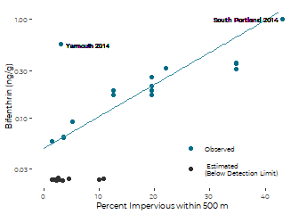

Prepare Sediment Bifenthrin Graphics
================
Curtis C. Bohlen, Casco Bay Estuary Partnership.
Revised October 13, 2020

-   [Introduction](#introduction)
-   [Load Libraries](#load-libraries)
-   [Load Data](#load-data)
    -   [Folder References](#folder-references)
    -   [Load IC Data](#load-ic-data)
    -   [Load Pyrethroid Concentration
        Data](#load-pyrethroid-concentration-data)
-   [Import IC metrics into
    conc\_data](#import-ic-metrics-into-conc_data)
-   [Principal Graphics](#principal-graphics)
    -   [Theil-Sen Resistent
        Regression](#theil-sen-resistent-regression)
    -   [Showing the Resistant
        Regression](#showing-the-resistant-regression)


# Introduction

In 2014 and 2015, the Maine Board of Pesticides Control collected
sediment samples from the Coast of Maine and Casco Bay, and analyzed
them for presence of selected pesticides, especially certain pyrethroid
pesticides.

The only pyrethroid that was observed consistently was bifenthrin,
probably because bifenthrin could be detected in sediment samples at
substantially lower concentrations than the other pyrethroid pesticides
on the testing panel.

We focus our analysis on bifenthrin. This Notebook develops a revised
version of a key graphic, in response to comments on afinal draft of the
related State of Casco Bay Chapter.

# Load Libraries

``` r
library(tidyverse)
```

    ## Warning: package 'tidyverse' was built under R version 4.0.5

    ## -- Attaching packages --------------------------------------- tidyverse 1.3.1 --

    ## v ggplot2 3.3.5     v purrr   0.3.4
    ## v tibble  3.1.4     v dplyr   1.0.7
    ## v tidyr   1.1.3     v stringr 1.4.0
    ## v readr   2.0.1     v forcats 0.5.1

    ## Warning: package 'ggplot2' was built under R version 4.0.5

    ## Warning: package 'tibble' was built under R version 4.0.5

    ## Warning: package 'tidyr' was built under R version 4.0.5

    ## Warning: package 'readr' was built under R version 4.0.5

    ## Warning: package 'dplyr' was built under R version 4.0.5

    ## Warning: package 'forcats' was built under R version 4.0.5

    ## -- Conflicts ------------------------------------------ tidyverse_conflicts() --
    ## x dplyr::filter() masks stats::filter()
    ## x dplyr::lag()    masks stats::lag()

``` r
library(mblm)

library(CBEPgraphics)
load_cbep_fonts()

library(LCensMeans)
```

# Load Data

## Folder References

``` r
sibfldnm <- 'Derived_Data'
parent   <- dirname(getwd())
sibling  <- file.path(parent,sibfldnm)

conc_fn <- 'BPC_2014_2015_Sediment_Data.txt'
geogr_fn <- 'imperviousness.txt'
```

## Load IC Data

``` r
ic_data <- read.delim(file.path(sibling, geogr_fn), sep = ',') %>%
  select(-OBJECTID, -Latitude, -Longitude) %>%
  rename(yr = 'Year_') %>%
  mutate(pctI500 = imperv500 / (pi*500^2),
         pctI1000 = imperv1000 / (pi*1000^2),
         pctI2000 = imperv2000 / (pi*2000^2)) %>%
  filter(Location != 8)       # Remove Bothbay Location
```

## Load Pyrethroid Concentration Data

``` r
conc_data <- read.delim(file.path(sibling, conc_fn), skip = 1) %>%
  select(1:15)
```

# Import IC metrics into conc\_data

We calculate estimated organic-carbon weighted concentrations AFTER
calculating maximum likelihood estimates of dry weight. Detection limits
for the relevant methods apply to dry weight concentrations, so that is
the appropriate place to calculate the ML estimators.

``` r
ml_estimator_Raw <- sub_cmeans(conc_data$Bifenthrin_Raw,
                                               conc_data$Bifenthrin_ND)
conc_data <- conc_data %>%
  mutate(pct500   = ic_data$pctI500[match(LocCode, ic_data$Location)],
         pct1000  = ic_data$pctI1000[match(LocCode, ic_data$Location)],
         pct2000  = ic_data$pctI2000[match(LocCode, ic_data$Location)]) %>%
  mutate(Bifenthrin_ML = ml_estimator_Raw,     # Raw observation (dry weight)
         Bifenthrin_OC_QML = Bifenthrin_ML * 100* (100/(100-Moisture)) / TOC) %>%
  mutate(across(starts_with('pct'), ~ round(.x * 100, 1)))
```

# Principal Graphics

### Theil-Sen Resistent Regression

We use a resistant regression estimator, known as the Theil-Sen
estimator, implemented (*inter alia*) as `mblm()` in the mblm package.
Statistical significance for these tests can be a bit finicky in the
case of tied values, which we have here, so we resort to testing
significance of the closely related Kendall’s Tau correlation
coefficient. In a more careful analysis, we might try permutation tests,
or a bootstrap, but in this case, the results are highly significant by
any test, so there is little point in being more precise.

Unfortunately, the mblm package does not handle missing values or data
transformations all that well, so we need to clean things up a bit.

``` r
tmp <- conc_data %>%
  filter(! is.na(pct500)) %>%
  select(pct500, Bifenthrin_ND, Bifenthrin_ML, Bifenthrin_OC_QML) %>%
  mutate(log_bifenthrin  = log(Bifenthrin_ML),
         log_bifenthrin_oc = log(Bifenthrin_OC_QML))
the_mblm <- mblm(log_bifenthrin~pct500, data = tmp)
```

We create a dataframe to pass to ggplot to generate the regression line
in our plot

``` r
coefs <- coef(the_mblm)
theline <- tibble(x = seq(0,42.5, .25),
                  y = exp(coefs[[1]] + coefs[[2]]*seq(0,42.5, .25)))
```

### Showing the Resistant Regression

``` r
plt <- ggplot(tmp, aes(pct500, Bifenthrin_ML)) +
  geom_point(aes(color = Bifenthrin_ND), size = 1.5) +
  geom_line(data = theline, aes(x,y),
            color = cbep_colors()[5],
            lwd = 0.5) +
  geom_text(aes(x=4, y=0.55, label = 'Yarmouth 2014'),
            hjust = 0, size = 1.9,
            family = 'montserrat') +
  geom_text(aes(x=42.5, y=0.99, label = 'South Portland 2014'),
            hjust = 1, size = 1.9) +
  
  theme_cbep(base_size = 7) +
  theme(legend.position=c(0.75, 0.2)) +
  
  scale_color_manual(values = cbep_colors()[c(1,3)], name = '',
                     labels = c('Observed', ' Estimated\n(Below Detection Limit)')) +
  scale_y_log10() +
  
  ylab('Bifenthrin (ng/g)') +
  xlab('Percent Impervious within 500 m')
plt
```

    ## Warning in grid.Call.graphics(C_text, as.graphicsAnnot(x$label), x$x, x$y, :
    ## font family not found in Windows font database

<!-- -->

``` r
ggsave('BifenthrinWW_resistant_revised.pdf', device = cairo_pdf, width = 3.5, height = 2.5)
```
